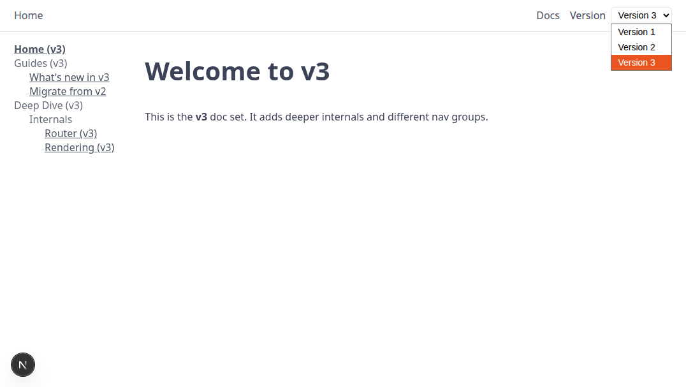

# Full Next.js example

This is a full-featured boilerplate for a creating a documentation website using Markdoc and Next.js. It has been customized with the following functionality:

- Doc version selector to select the appropriate version of the documentation.
- Left navigation. Each version of your documentation has its own left navigation and its own documentation set.



## Prerequisites

- [Node.js](https://nodejs.org/) in your CLI environment.

## Setup

To set up your system:

1. Clone this repo.
1. Install the dependencies:

    ```bash
    npm install
    # or
    yarn install
    ```

If you wish, you can now [view the webapp](#view-webapp).

## Create documentation

To create documentation, you perform the following activites:

- [Author documentation](#author-documentation).
- [Create left navigations](#create-left-navigations).
- [Configure version selector](#configure-version-selector).
- [Configure home page](#configure-home-page).

### Author documentation

Each documentation version should have its own documentation set in its own subfolder under `/pages/` for example, `/pages/v1`, `/pages/v2`, and `/pages/v3`. The following is a typical directory structure for docs:

```bash
pages/
├── api #Tech. writers can leave this directory alone. This is for devs.
├── _app.tsx
├── index.md -> v1/guides/introduction/getting-started.md
├── v1 #Folder containing v1 of documentation 
├── v2 #Folder containing v2 of documentation 
└── v3 #Folder containing v3 of documentation 
```

You'll use information about this structure next, when creating the left navigation and configuring the version selector.

### Create left navigations

Each doc set has its own left navigation file, `sidenav.json` in its own directory under `nav/`. You are free to name these directories however you like. The following is a typical directory structure.

```bash
nav/
├── v1
│   └── sidenav.json #Each sidenav.json is specific to a particular version of the documentation.
├── v2
│   └── sidenav.json #This sidenav.json is different from the other two.
├── v3
│   └── sidenav.json
└── versions.json
```

You can create arbitrarily nested left navigations, but only the innermost entries link to files. The display name of the file entries in the left navigation is independent of the file names. To specify how a particular file appears in the left navigation, enter a value of `label` for that file, and link to the file by specifying a value `path` that is relative to the documentation root for that doc set. As an example, examine this JSON snippet from a `sidenav.json` file for version 3 of our application:

```json
{
  "label": "What's new in v3",
  "path": "/guides/whats-new"
},
```

This snippet indicates that the file `pages/v3/guides/whats-new.md` should have the label **What's new in v3** in the left nav. The `path` value was specified as `/guides/whats-new`, because the root of version 3 of the docs is at `pages/v3/`. (See the directory structure above, in [Author documentation](#author-documentation).) You will formally specify this using the `docsRoot` value specified in `versions.json`, as explained in the section on [configuring the version selector](#configure-version-selector). 

**IMPORTANT:** When specifying the path of the file, leave off the extension at the end.

The following is a typical `sidenav.json` file:

```json
[
  {
    "label": "Home (v3)",
    "path": "/"
  },
  {
    "label": "Guides (v3)",
    "children": [
      {
        "label": "What's new in v3",
        "path": "/guides/whats-new"
      },
      {
        "label": "Migrate from v2",
        "path": "/guides/migrate"
      }
    ]
  },
  {
    "label": "Deep Dive (v3)",
    "children": [
      {
        "label": "Internals",
        "children": [
          {
            "label": "Router (v3)",
            "path": "/deep/internals/router"
          },
          {
            "label": "Rendering (v3)",
            "path": "/deep/internals/rendering"
          }
        ]
      }
    ]
  }
]
```

### Configure version selector

The `versions.json` file is a config file that specifies the following, for each version of the documentation:

- `label`: The label for that version of the documentation in the version selector of the webapp.
- `sidenav`: Where `sidenav.json` is kept for that version of the docs.
- `docsRoot`: Where the root of the docs is for that version, relative to `pages`.

The following is a typical `versions.json` file:

```bash
{
  "default": "v1",
  "versions": [
    {
      "key": "v1",
      "label": "Version 1",
      "docsRoot": "/v1", #This means that documentation for this version is is at `pages/v1`.
      "sidenav": "nav/v1/sidenav.json"
    },
    {
      "key": "v2",
      "label": "Version 2",
      "docsRoot": "/v2",
      "sidenav": "nav/v2/sidenav.json"
    },
    {
      "key": "v3",
      "label": "Version 3",
      "docsRoot": "/v3",
      "sidenav": "nav/v3/sidenav.json"
    }
  ]
}
```

### Configure home page

Selecting **Home** in the upper left of the webapp takes to the user to a home page. To specify which page you want for the home page, create a symlink from `pages/index.md` to your desired home page. The following is an example of commands used to create the symlink. Use your own paths to create a symlink that works for you:

```bash
cd pages
mv index.md index.bak #You can back up your existing index.md file.
ln -s v1/guides/introduction/getting-started.md index.md
```

## View webapp

To view your docs webapp, run the dev server:

```bash
npm run dev
# or
yarn dev
```

Open [http://localhost:3000](http://localhost:3000) with your browser to see the result. Use the version selector in the top right to select the version of the documentation that you want.

## Deploy

The quickest way to deploy your own version of this boilerplate is by deploying it with [Vercel](https://vercel.com) or [Netlify](https://www.netlify.com/) by clicking one of the buttons below.

### Deploy with Vercel

[](https://vercel.com/new/clone?repository-url=https://github.com/markdoc/next.js-starter)

### Deploy to Netlify

[](https://app.netlify.com/start/deploy?repository=https://github.com/markdoc/next.js-starter)
